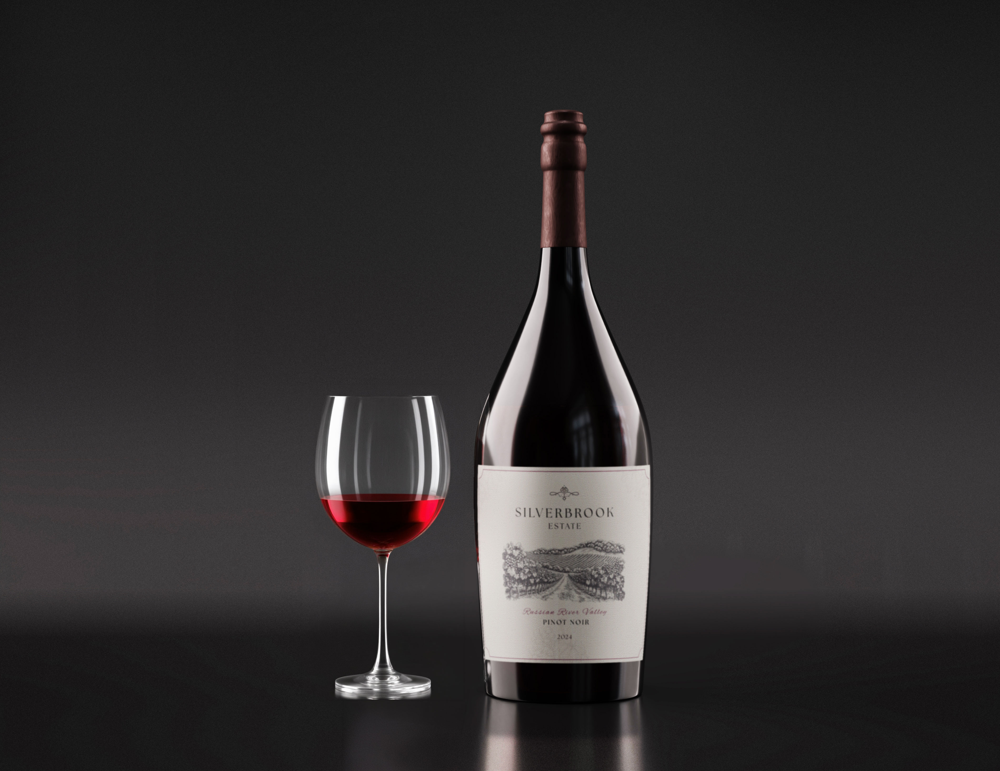

# Silverbrook Estate - Premium Wine Website

A luxurious, one-page website showcasing **Silverbrook Estate**, an ultra-premium winery specializing in limited-production Pinot Noir and other fine wines from California's Russian River Valley.



---

## 🍇 Project Overview

Silverbrook Estate is an elegant, high-end wine brand website designed to communicate exclusivity, craftsmanship, and terroir-driven winemaking. The site features sophisticated design elements, smooth scroll animations, and premium typography that reflects the quality of the wines presented.

### Key Features

- **Responsive One-Page Design**: Seamless navigation across multiple sections
- **Premium Aesthetic**: Luxury color palette and elegant typography (Cormorant Garamond & Inter)
- **Scroll Animations**: Smooth reveal animations as users navigate the site
- **Multiple Wine Varietals**: Showcase Pinot Noir, Chardonnay, Cabernet Sauvignon, and Merlot
- **Collector's Circle Membership**: Exclusive community offering priority access and special events
- **Mobile Optimized**: Fully responsive design for all devices
- **SEO-Optimized**: Meta tags and semantic HTML for search engine visibility

---

## 📁 Project Structure

```
Silver-Brook/
├── index.html          # Main HTML structure
├── styles.css          # Complete styling (1055+ lines)
├── script.js           # Interactive animations and functionality
├── robots.txt          # SEO robots directives
├── README.md           # Project documentation
└── assets/             # Image assets
    ├── logo.png                          # Silverbrook logo
    ├── hero-img.jpg                      # Hero section bottle image
    ├── Where-Fog-Meets-Precision.png    # Story section vineyard image
    ├── The-Russian-River-Valley-Advantage.jpg
    ├── moments-Worth-Bottling-img.png   # Lifestyle section
    ├── Tenuta---Napa-Valley-chardonnay.png
    ├── Tenuta---Napa-Valley-Merlot.png
    ├── Tenuta---Cabernet-Sauvignon.jpg
    ├── Russian-River-Chardonnay.jpg
    ├── Mockup1.png                       # Collector's Circle mockup
    └── [other wine varietal images]
```

---

## 🎨 Design & Branding

### Color Palette

| Color | Hex | Usage |
|-------|-----|-------|
| Soft Cream | `#FAFAFA` | Primary background |
| Warm Cream | `#F3F1EC` | Secondary background |
| Deep Wine Red | `#7A1F2D` | Primary accent (Pinot Noir inspired) |
| Deep Wine Red (Hover) | `#5D1621` | Interactive hover state |
| Dark Text | `#1A1A1A` | Primary text |
| Soft Gray | `#4A4A4A` | Secondary text |

### Typography

- **Serif Font**: *Cormorant Garamond* - Elegant headings
- **Sans-serif Font**: *Inter* - Clean body text and navigation
- **Font Weights**: 300, 400, 500, 600, 700 (weights vary by font)

### Design Principles

- **Luxury & Exclusivity**: Premium spacing, high-quality imagery, refined details
- **Minimalist Layout**: Ample whitespace and thoughtful hierarchy
- **Terroir Storytelling**: Each section connects wine quality to location and process
- **Premium Frame Elements**: Custom bordered frames around product and region imagery

---

## 📑 Page Sections

### 1. **Navigation Bar**
- Fixed header with logo
- Links to main sections: Our Story, The Wine, The Region
- Clean, minimalist design

### 2. **Hero Section**
- Eye-catching headline: "Silverbrook Estate"
- Subtitle: "Russian River Valley Pinot Noir"
- Premium bottle imagery in custom frame
- Call-to-action button: "Shop the 2024 Pinot Noir"

### 3. **Brand Story** ("Where Fog Meets Precision")
- Narrative on Silverbrook's winemaking philosophy
- Emphasis on small-lot, intentional production
- Split layout with atmospheric vineyard imagery
- Reveals the terroir advantage

### 4. **The Wine Section**
- **Tasting Notes**: Sensory profile (aromas, palate, finish)
- **Winemaking Process**: Hand-harvesting, small-lot fermentation, French oak aging
- **Wine Details**: Appellation, vintage, varietal, alcohol content, production volume
- **Pricing**: MSRP $75/bottle, highly limited production (<100 cases)

### 5. **Lifestyle Section** ("Moments Worth Bottling")
- Full-image background showcasing wine enjoyment
- Aspirational messaging about shared moments and memories
- Emotional connection to the product

### 6. **The Region Section** ("The Russian River Valley Advantage")
- Educational content on terroir and regional characteristics
- Explanation of fog's role in preserving acidity
- Beautiful landscape imagery with "Terroir Driven" caption

### 7. **Featured Varietals**

#### Chardonnay ("The Golden Standard")
- Limited release from Napa Valley
- Profile: Bright citrus, vanilla bean, toasted brioche
- Aged in neutral French oak
- Creamy, luxurious mouthfeel

#### Cabernet Sauvignon ("The Cabernet Command")
- Dark, bold expression of volcanic terroir
- Nose: Blackberry, graphite, cedar
- Palate: Full-bodied, velvet tannins
- Allocated access for exclusive members

#### Merlot ("The Merlot Nuance")
- Single-vineyard, hillside-sourced
- Profile: Dark plum, cocoa, dried herbs
- Soft elegance with hidden depth
- Premium single-block production

### 8. **Collector's Circle Membership**
- Exclusive community program
- **Benefits**:
  - Priority allocation of limited releases
  - Library vintage access
  - Exclusive tasting events
  - Private cellar tours
  - Invitations to intimate estate dinners

### 9. **Final CTA & Footer**
- Closing message emphasizing exclusivity and scarcity
- "Limited. Elegant. Unforgettable."
- Final shop button
- Copyright and responsibility disclaimer

---

## 💻 Technical Stack

### Frontend
- **HTML5**: Semantic structure with accessibility considerations
- **CSS3**: Custom properties (CSS variables), flexbox, grid layouts
- **JavaScript**: Vanilla JS for scroll animations and interactivity
- **Fonts**: Google Fonts (Cormorant Garamond, Inter)

### Key CSS Features
- Custom property system for maintainability
- Responsive breakpoints for mobile/tablet/desktop
- Smooth transitions and animations
- Premium frame styling with borders
- Split layouts and reverse layouts for visual variety

### JavaScript Functionality
- Smooth scroll behavior
- Scroll-triggered animations (reveal effects)
- Navigation anchor links
- Responsive menu interactions

---

## 🚀 Getting Started

### Installation

1. **Clone the repository**:
   ```bash
   git clone https://github.com/yashbarott/Silver-Brook.git
   cd Silver-Brook
   ```

2. **Open in a browser**:
   - Open `index.html` directly in your web browser
   - Or serve locally using a simple HTTP server:
   ```bash
   python3 -m http.server 8000
   # Visit http://localhost:8000 in your browser
   ```

### Requirements
- Modern web browser (Chrome, Firefox, Safari, Edge)
- No build tools or dependencies required
- Works offline (all assets are local)

---

## 📱 Responsive Design

The website is fully responsive with optimized layouts for:
- **Desktop** (1200px+): Full multi-column layouts, premium spacing
- **Tablet** (768px - 1199px): Adjusted spacing, optimized image sizes
- **Mobile** (< 768px): Single-column layouts, touch-friendly navigation

---

## 🔍 SEO Optimization

- Semantic HTML5 structure
- Meta description for search engines
- Responsive viewport configuration
- `robots.txt` for crawling directives
- Open Graph potential (ready for social sharing)

---

## 🎬 Animation Details

### Scroll Reveal Animation
- Elements fade in and slide up as they come into view
- Smooth cubic-bezier easing: `cubic-bezier(0.16, 1, 0.3, 1)`
- Staggered timing for multiple elements

### Hover Effects
- Buttons shift color on hover: `#7A1F2D` → `#5D1621`
- Smooth transitions (0.3s) for interactive elements
- Premium feel with subtle micro-interactions

---

## 🎯 Key Messages & Branding

- **Heritage**: Small-lot, intentional winemaking
- **Quality**: Hand-harvested fruit, premium oak aging, minimal intervention
- **Exclusivity**: Extremely limited production, allocated access
- **Terroir**: Russian River Valley's natural advantages showcased throughout
- **Lifestyle**: Wine as enabler of memorable moments and connections

---

## 📄 License

This project is created for Silverbrook Estate Winery. All rights reserved © 2026.

---

## 👤 Author

**Yash Barott**

GitHub: [yashbarott](https://github.com/yashbarott)

---

## 📞 Contact & Information

For inquiries about Silverbrook Estate wines or membership:
- Website: This one-page site serves as the primary marketing hub
- Message: "Please enjoy responsibly"

---

## 🍷 Wine Information Summary

### Flagship Wine: Silverbrook Estate 2024 Pinot Noir

| Property | Value |
|----------|-------|
| **Appellation** | Russian River Valley, California |
| **Vintage** | 2024 |
| **Varietal** | Pinot Noir |
| **Alcohol Content** | ~13.5% ABV |
| **Production** | Very Limited (under 100 cases) |
| **Price** | $75 USD per bottle |
| **Tasting Profile** | Bright ruby, wild strawberry, crushed raspberry, rose petal, forest floor, baking spice, silky palate, cherry, cranberry, clove |
| **Winemaking** | Hand-harvested, small-lot fermentation, 8 months French oak aging, minimal intervention |
| **Best For** | Special occasions, fine dining, cellar investment |

---

## 🌟 Notable Features

✨ **Sophisticated Visual Hierarchy** - Premium use of whitespace and typography  
🎨 **Luxury Brand Experience** - Every detail reflects quality and exclusivity  
🍇 **Terroir Storytelling** - Education on wine regions and production methods  
📱 **Mobile-First Responsive** - Seamless experience across all devices  
✅ **Performance Optimized** - Fast loading with optimized assets  
♿ **Accessibility Ready** - Semantic HTML and ARIA considerations  

---

## 🔮 Future Enhancement Ideas

- Add e-commerce functionality for direct sales
- Implement wine club membership sign-up with Stripe integration
- Add tasting event calendar
- Create wine education blog section
- Add virtual vineyard tour with 360° imagery
- Implement customer reviews/testimonials section
- Add email newsletter subscription
- Create PDF wine pairing guide downloads

---

## 📚 Resources Used

- [Google Fonts](https://fonts.google.com/) - Typography
- [CSS Custom Properties](https://developer.mozilla.org/en-US/docs/Web/CSS/--*) - Design system
- Responsive web design principles
- Web accessibility best practices

---

**Last Updated**: 2026  
**Status**: Production Ready